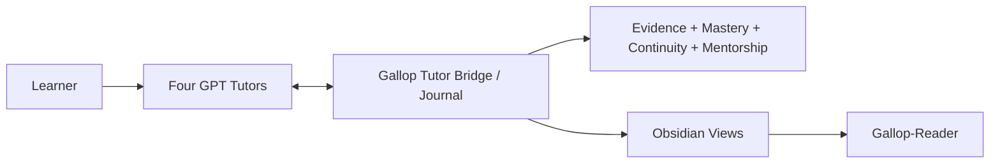

# Gallop

**A local-first, evidence-driven Progressive Mentorship Engine for mathematics, statistics/econometrics, finance, and CS/AI.**

[简体中文](README.md) · [Capabilities & boundaries](docs/capabilities-and-boundaries.md) · [Quickstart](docs/quickstart.md) · [Architecture](docs/architecture.md) · [Current status](docs/current-status.md) · [Tutor Protocol](docs/v1.2-tutor-protocol.md) · [Roadmap](docs/roadmap.md) · [Security](SECURITY.md) · [Apache-2.0](LICENSE)

> **Current source baseline: Gallop v1.2.0 — Zero-Touch Learning Continuity.** Four subject-bound GPT Tutor conversations are the learner-facing surface; Gallop runs underneath them to govern the Journal, evidence authority, continuity, mastery/readiness, Progressive Mentorship, and Obsidian / Gallop-Reader projections. Controlled four-Tutor real dogfood passed on 2026-09-14. GitHub Release/tag state is managed separately from source capability.

## Core principle

> **GPT = TEACH · GALLOP = GOVERN · OBSIDIAN = REMEMBER · EVIDENCE = PROVE**

Gallop never treats “the GPT says you mastered it” as mastery. Learning activity is stored as replayable, auditable evidence in a local Journal: concept exposure, mistakes, hints, independent attempts, repair, retest, checkpoints, and session finalization all carry stable identity and provenance. Obsidian and Gallop-Reader are derived views, never authority.

## Complete capability map

Gallop v1.2 is more than the Four-Tutor bridge. The repository currently implements and preserves the following governed capabilities:

| Capability layer | Existing capability | Current role / boundary |
|---|---|---|
| Learner surface | Mathematics / Statistics & Econometrics / Finance / CS & AI subject-bound GPT Tutor MCP servers | Primary learner surface; each Tutor can access only its own subject context |
| Session continuity | Stable session/event identity, open/resume, record, checkpoint, finalize, readback | Exact retry is idempotent; same ID with different content fails closed |
| Fresh-chat continuity | Restore bounded Journal-derived context in a new chat | Old transcript/model memory is not authority |
| Recovery | Incremental checkpoints, abrupt-close restore, projection recovery | Journal commit precedes projection refresh; projection failure does not erase committed evidence |
| Journal / replay | Append-only Journal, deterministic replay, integrity guards | Journal is source of truth; derived caches are rebuildable |
| Evidence authority | Observation, attempt, candidate assessment, human attestation, independent/assisted/solution-seen/AI-assisted/generated provenance | Tutor/model/provider output cannot directly promote mastery |
| Mastery / readiness | Conservative mastery, confidence, evidence refs, readiness profiles | Praise, one correct answer, or a model score is insufficient for mastery |
| Elite evidence | Task type, quality, hints, agent provenance, transfer, failure mode, benchmark, prerequisite links | No opaque global ability score and no award prediction |
| Progressive Mentorship | Current capability, target gap, prerequisite diagnosis, training zone, productive struggle, scaffolding, next action, gains, mentor role, research independence | Targets never inflate current capability; mentorship is advisory only |
| Subject policy | One engine with subject-specific policy data | Proofs, derivations, simulations, empirical work, oral work, papers, coding/no-agent coding, systems, research, benchmarks |
| Automation V1 | Intake, queue/explain, prepare, confirmed start, human-confirmed ingest, cycle, replay, projection, recovery | Real compatibility/developer surface, not a second learner UI |
| DeepTutor bridge | Durable submit / poll / collect and provider lifecycle | Legacy / optional / non-authoritative; not required by v1.2 Zero-Touch |
| Legacy v0.1 | Session → manifest → result → mastery, offline demo, old schemas/CLI | Preserved without silently reinterpreting history |
| No-Agent evidence | No-agent, closed-book, assistance/agent provenance conditions | Evidence semantics, not technical proctoring |
| Obsidian | Managed Session / Concept / Mistake / Home / Development / readiness / benchmark projections | Manual projection edits do not become authority; ownership conflicts fail closed |
| Gallop-Reader | One-way Main Vault → Reader publication, dry-run, receipts, backup/recovery, mobile visibility | Reading mirror only; no phone → Vault authority writeback |
| iCloud-aware safety | Windows/iCloud binding and Cloud Files metadata gate | Safety gate, not a generic cloud provisioning/repair engine |
| Versioned schemas | Session, practice, automation, Elite evidence, benchmark, readiness, target, prerequisite, Tutor event/directive, learning context, policies | Contradictory input is rejected instead of normalized into invented evidence |
| Governance / CI | Architecture Gate, privacy audit, V1 exact replay, pytest, Ruff, Mypy, examples, demo, wheel | Main matrix: Windows/Ubuntu × Python 3.11/3.13 |

The authoritative item-by-item inventory is **[Existing Capabilities and Product Boundaries](docs/capabilities-and-boundaries.md)**.

## Primary v1.2 path



Normal learning happens directly in the relevant Tutor conversation. The Tutor Bridge opens or restores a session, returns bounded context, records learning events, checkpoints, and finalization. Gallop maintains the append-only Journal, deterministic replay, evidence authority, and Progressive Mentorship; Obsidian and Reader present derived state.

**DeepTutor is an optional legacy adapter and is not on the v1.2 critical path.**

## Hard product boundaries

These are explicit v1.2 boundaries, not missing future work:

- **No separate Gallop learner UI.** The four GPT Tutor conversations are the learner-facing surface.
- **No model-as-grader authority.** GPT/provider output may teach, observe, or submit candidate evidence, but cannot directly award mastery.
- **No identity verification or proctoring.** Human attestation is explicit local confirmation, not proof of authorship.
- **No autonomous curriculum owner.** Progressive Mentorship is advisory; it does not silently rewrite targets, schedules, or course plans.
- **No hidden agent swarm.** Gallop is a learning governance/continuity/evidence system, not a general autonomous-agent framework.
- **No mandatory DeepTutor.** DeepTutor remains only a legacy optional adapter.
- **No cross-subject or cross-concept evidence leakage.** Evidence for one subject/concept does not certify another.
- **No silent migration of historical state.** Persistent meaning changes require explicit versioning/migration.
- **No psychometric validity claim.** Mastery/readiness are conservative software-governance constructs, not validated educational measurement.
- **No hostile-owner tamper-proof claim.** Hash chains and SQLite guards detect consistency problems; they do not defeat a machine owner with full control.
- **No distributed atomicity claim.** Journal commits are authoritative; Obsidian/Reader/cloud publication is recoverable but not one distributed transaction.
- **No generic cloud provisioning.** Gallop can safely publish through a validated Reader path; it does not provision or repair arbitrary iCloud/Obsidian setups.
- **No guarantee that privacy filters catch every sensitive sentence.** Repository audit and Reader filtering are defense in depth.
- **No semantic-retrieval platform, broad plugin ecosystem, Gallop UI, or Yau-specific competition engine in the v1.2 baseline.**
- **Source version does not imply release state.** `gallop-learning==1.2.0`, GitHub Release/tag, PyPI, and attached assets are separate facts.

## Authority boundaries

| Surface | May do | Must not do |
|---|---|---|
| GPT Tutor | teach, ask, explain, observe, submit candidate events/assessments | declare authoritative mastery, mutate another subject, replace the Journal |
| Tutor MCP / Runtime Bridge | validate, record, checkpoint, resume, expose bounded context | bypass evidence rules or fabricate history |
| Journal | persist accepted authoritative events and support replay | infer unstated learner success |
| Evidence / mastery policy | admit/classify evidence and derive capability | treat praise/provider output/model confidence as mastery |
| Progressive Mentorship | recommend zones, scaffolds, repair/retest, next action | silently mutate the queue, lower the target ceiling, certify capability without evidence |
| Obsidian | show governed human-readable projections | mutate authoritative state through manual Markdown edits |
| Gallop-Reader | provide mobile reading continuity | write authoritative state back into Journal/Vault |
| DeepTutor / provider | optionally generate practice material | become a mandatory dependency or independent assessment authority |

## Real acceptance

The [v1.2 Real Four-Tutor Dogfood Acceptance](docs/audits/v1.2-real-dogfood-acceptance.md) covers:

- four real subject-bound Tutor sessions;
- Mathematics proof → diagnosed mistake → assisted repair → fresh-chat closed-book retest;
- Statistics fixed-seed simulation reasoning;
- Finance closed-book derivation;
- CS/AI `NO_AGENT_CODING`;
- abrupt-close restoration and duplicate checkpoint recovery;
- automatic Obsidian projection and fail-closed projection recovery;
- one-way Gallop-Reader publication, recovery, and learner-confirmed mobile visibility;
- four-subject isolation plus candidate-evidence / human-attestation authority boundaries.

Acceptance intentionally preserved weak outcomes instead of hiding them: when the Mathematics independent retest was `PARTIAL`, Gallop kept the state at `GUIDED`, mastery `0`, instead of lowering the evidence standard.

## Isolated offline example

Requires Python 3.11+:

```bash
git clone https://github.com/lucaschang2021/gallop.git
cd gallop
python -m venv .venv
python -m pip install -e ".[dev]"
python -m gallop demo --output demo-output
```

Automation V1 and legacy CLI workflows remain useful for tests, compatibility, and development. Never treat synthetic demo output as real learner evidence. See the [Quickstart](docs/quickstart.md) and [CLI reference](docs/automation-cli.md).

## Engineering boundaries

- `gallop/tutor/`: v1.2 Tutor Protocol, Runtime Bridge, bounded context, MCP transport.
- `gallop/automation/`: Journal/application orchestration, replay, queue, views, durable jobs.
- `gallop/progression/`: pure Progressive Mentorship decision domain.
- `gallop/projections/`: v1.2 Tutor/Obsidian projections.
- `gallop/schemas/`: protocol, evidence, readiness, target, prerequisite, and related schemas.
- `ARCHITECTURE.toml` + `scripts/check_architecture.py`: executable architecture contract and drift gate.
- `.github/workflows/tests.yml`: Windows/Ubuntu × Python 3.11/3.13 Ruff, Mypy, pytest, V1 exact replay, examples, architecture, privacy audit, demo, and wheel build.

## Safety and evidence

- Private Journal data, real answers, provider runtime, configuration, and credentials must not enter the repository or Reader.
- Tutor assessment is not human attestation; an Obsidian edit is not a progression mutation.
- Independent evidence must satisfy assistance / agent-usage constraints; AI-generated code cannot count as independent coding evidence.
- Reader filtering is defense in depth, not universal sensitive-text detection.

See [Capabilities & boundaries](docs/capabilities-and-boundaries.md), [Architecture](docs/architecture.md), [v1.2 Tutor Protocol](docs/v1.2-tutor-protocol.md), [Real integration](docs/v1.2-real-tutor-integration.md), [Safety](docs/automation-safety.md), and [Current status](docs/current-status.md).

## Current engineering state

The source package is `gallop-learning` `1.2.0`. v1.2 controlled real dogfood is complete; the mainline Windows/Ubuntu × Python 3.11/3.13 CI matrix has completed successfully. Release pages, tags, PyPI, and attached artifacts are separate release-management concerns and must not be confused with source capability or dogfood acceptance.

The next phase is **sustained daily use, real learning evidence accumulation, regression monitoring, and small maintenance changes** rather than another architecture expansion.

## License

Gallop uses the [Apache License 2.0](LICENSE). Third-party tools and services retain their own terms.