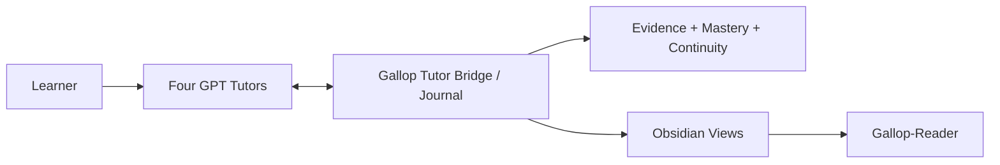

# Gallop

**A local-first, evidence-driven Progressive Mentorship Engine for mathematics, statistics/econometrics, finance, and CS/AI.**

[简体中文](README.md) · [Quickstart](docs/quickstart.md) · [Architecture](docs/architecture.md) · [Current status](docs/current-status.md) · [Tutor Protocol](docs/v1.2-tutor-protocol.md) · [Roadmap](docs/roadmap.md) · [Security](SECURITY.md) · [Apache-2.0](LICENSE)

> **Current source baseline: Gallop v1.2.0 — Zero-Touch Learning Continuity.** Four subject-bound GPT Tutor conversations are the learner-facing surface; Gallop runs underneath them to govern the Journal, evidence authority, continuity, mastery, and Obsidian / Gallop-Reader projections. Controlled four-Tutor real dogfood passed on 2026-09-14. GitHub Release/tag state is managed separately from source capability.

## Core principle

> **GPT = TEACH · GALLOP = GOVERN · OBSIDIAN = REMEMBER · EVIDENCE = PROVE**

Gallop never treats “the GPT says you mastered it” as mastery. Learning activity is stored as replayable, auditable evidence in a local Journal: concept exposure, mistakes, hints, independent attempts, repair, retest, checkpoints, and session finalization all carry stable identity and provenance. Obsidian and Gallop-Reader are derived views, never authority.

## What v1.2 implements

| Capability | Current state | Boundary |
|---|---|---|
| Four-Tutor Zero-Touch | Mathematics / Statistics & Econometrics / Finance / CS & AI subject-bound GPT Tutor MCP servers | A Tutor can only access and write its own subject context |
| Fresh-chat continuity | A new chat can restore bounded context from the Journal using a stable session identity | No dependency on the old transcript or model memory as authority |
| Incremental checkpointing | Meaningful learning work is committed incrementally and can survive abrupt exit | Journal commits precede projection refresh |
| Evidence authority | Distinguishes independent, hinted, solution-seen, AI-generated, and other evidence classes | Tutor assessment is candidate evidence, not a mastery mutation |
| Progressive Mentorship | Uses current capability, target, prerequisites, productive struggle, and scaffolding to shape guidance | Targets never raise current capability |
| Obsidian projection | Automatically projects managed Session / Concept / Mistake / Home views | Journal is authoritative; ownership anomalies fail closed |
| Gallop-Reader | Validated one-way PC → Vault → Reader publication and recovery | Reader is a reading mirror, not bidirectional state |
| Recovery / idempotency | Abrupt-close restore, exact duplicate recovery, deterministic replay | Duplicate events do not become duplicate learning evidence |
| Legacy compatibility | Automation V1 and v0.1 workflows remain available | Historical mastery is not silently migrated or reinterpreted |

## Real acceptance

The [v1.2 Real Four-Tutor Dogfood Acceptance](docs/audits/v1.2-real-dogfood-acceptance.md) covers:

- four real subject-bound Tutor sessions;
- Mathematics proof → diagnosed mistake → assisted repair → fresh-chat closed-book retest;
- Statistics fixed-seed simulation reasoning;
- Finance closed-book derivation;
- CS/AI `NO_AGENT_CODING`;
- abrupt-close restoration and duplicate checkpoint recovery;
- automatic Obsidian projection and fail-closed projection recovery;
- one-way Gallop-Reader publication, recovery, and learner-confirmed mobile visibility;
- four-subject isolation plus candidate-evidence / human-attestation authority boundaries.

Acceptance intentionally preserved weak outcomes instead of hiding them: when the Mathematics independent retest was `PARTIAL`, Gallop kept the state at `GUIDED`, mastery `0`, instead of lowering the evidence standard.

## Daily-use shape



Normal learning happens directly in the relevant Tutor conversation. The Tutor Bridge opens or restores a session, returns bounded context, records learning events, checkpoints, and finalization. Gallop maintains the append-only Journal, deterministic replay, and evidence authority; Obsidian and Reader present derived state.

**DeepTutor is now an optional legacy adapter. It is not on the v1.2 critical path.**

## Isolated offline example

Requires Python 3.11+:

```bash
git clone https://github.com/lucaschang2021/gallop.git
cd gallop
python -m venv .venv
python -m pip install -e ".[dev]"
python -m gallop demo --output demo-output
```

Automation V1 and legacy CLI workflows remain useful for tests, compatibility, and development. Never treat synthetic demo output as real learner evidence. See the [Quickstart](docs/quickstart.md) and [CLI reference](docs/automation-cli.md).

## Engineering boundaries

- `gallop/tutor/`: v1.2 Tutor Protocol, Runtime Bridge, bounded context, MCP transport.
- `gallop/automation/`: Journal/application orchestration, replay, queue, views, durable jobs.
- `gallop/progression/`: pure Progressive Mentorship decision domain.
- `gallop/projections/`: v1.2 Tutor/Obsidian projections.
- `gallop/schemas/`: protocol, evidence, readiness, target, prerequisite, and related schemas.
- `ARCHITECTURE.toml` + `scripts/check_architecture.py`: executable architecture contract and drift gate.
- `.github/workflows/tests.yml`: Windows/Ubuntu × Python 3.11/3.13 Ruff, Mypy, pytest, V1 exact replay, examples, architecture, privacy audit, demo, and wheel build.

## Safety and evidence

- Private Journal data, real answers, provider runtime, configuration, and credentials must not enter the repository or Reader.
- Tutor assessment is not human attestation; an Obsidian edit is not a progression mutation.
- Independent evidence must satisfy assistance / agent-usage constraints; AI-generated code cannot count as independent coding evidence.
- Local hash-chain / SQLite triggers protect consistency and detect accidental corruption; they are not a hostile-owner tamper-proof guarantee.
- Reader filtering is defense in depth, not universal sensitive-text detection.

See [Architecture](docs/architecture.md), [v1.2 Tutor Protocol](docs/v1.2-tutor-protocol.md), [Real integration](docs/v1.2-real-tutor-integration.md), [Safety](docs/automation-safety.md), and [Current status](docs/current-status.md).

## Current engineering state

The source package is `gallop-learning` `1.2.0`. v1.2 controlled real dogfood is complete; the mainline Windows/Ubuntu × Python 3.11/3.13 CI matrix has completed successfully. Release pages, tags, PyPI, and attached artifacts are separate release-management concerns and must not be confused with source capability or dogfood acceptance.

The next phase is **sustained daily use, real learning evidence accumulation, regression monitoring, and small maintenance changes** rather than another architecture expansion. Competition Mathematics / Yau specialization, semantic retrieval, a general plugin ecosystem, and a Gallop UI are outside the v1.2 baseline.

## License

Gallop uses the [Apache License 2.0](LICENSE). Third-party tools and services retain their own terms.