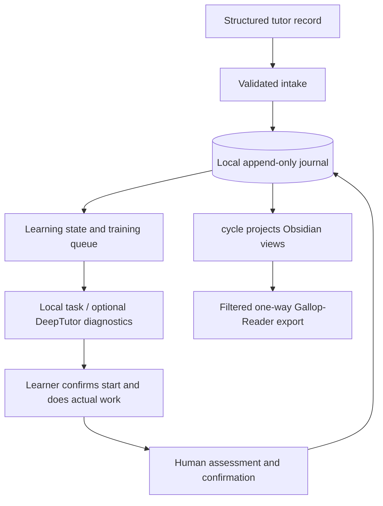

# Gallop

**Turn AI tutoring notes, weaknesses, and real practice records into a learning plan you can keep tracking—a local-first Python learning orchestration tool.**

[简体中文](README.md) · [Quickstart](docs/quickstart.md) · [Architecture](docs/architecture.md) · [Current status](docs/current-status.md) · [Roadmap](docs/roadmap.md) · [Contributing](CONTRIBUTING.md) · [Security](SECURITY.md) · [Apache-2.0](LICENSE)

> **Stable release: v1.0.0 / Automation V1; current candidate: v1.1.0rc2.** The candidate adds the Elite Training Protocol and Progressive Mentorship Engine. This remains an early-stage project with no guarantee of learning outcomes. Try the isolated example before connecting real notes.

## Why Gallop?

Finishing an AI lesson is not the same as mastering its subject. Conversations scatter, weaknesses get forgotten, and one correct answer does not establish independent performance.

Gallop connects **what the tutor observed → what to practice next → evidence of actual performance**. Learners keep local records, inspect reasons for state changes, and read today's training, reviews, and open questions in Obsidian.

For example, a tutor records repeated confusion about quantifier order in continuity. Gallop retains that weakness, creates a training candidate, and prepares an independent task. Only after actual work and human-confirmed assessment does it evaluate a conservative state update. Importing a lesson summary alone never promotes mastery.

**AI organizes deliberate practice; the learner still does the thinking.** Read the [philosophy](docs/philosophy.md).

## Who is it for?

- Self-directed learners, students, and researchers connecting long-term AI tutoring to practice.
- Obsidian users comfortable managing learning records through a CLI.
- Developers integrating structured tutor output or practice engines.

Automation currently ships policies for mathematics, statistics/econometrics, finance, and CS/AI. The underlying protocols can be extended, but new subjects need policies and validation. This is not a hosted course platform or automatic grader.

## Capabilities and boundaries

| Capability | Implemented today | Boundary |
|---|---|---|
| Tutor intake | Import JSON or protocol Markdown containing lessons, concepts, mistakes, and questions; retain raw input | No ChatGPT account scraping; requires a [compatible file](docs/tutor-protocol.md) |
| Persistent state | Append-only SQLite events, deterministic replay, explanations, and evidence references | The journal governs new Automation records; no implicit legacy migration |
| Training and review | Four subject policies, P0–P4 priorities, T+1/T+7/T+30 review candidates | Explicit CLI runs, no daemon or automatic reminders |
| Practice preparation | Local task specifications; optional DeepTutor diagnostics with durable submit/poll/collect jobs | DeepTutor is separate; choice questions cannot replace proof, oral, coding, or simulation work |
| Mastery evaluation | Levels 0–5 and low/medium/high confidence from human-confirmed actual results | Generated material is not completed training; one correct answer does not promote mastery |
| Elite training and progressive mentorship (v1.1 RC) | Distinguish independent, hinted, solution-seen, and AI-generated evidence; derive training zones, scaffolding, and prerequisite repair from an explicit target and current evidence | A target never raises current capability; guidance does not schedule work, and the Human Production E2E remains pending |
| Notes and mobile reading | Managed Obsidian Markdown regions and filtered one-way Gallop-Reader export | Reader is not bidirectional sync; real publication requires an existing verified Reader binding |
| Legacy compatibility | v0.1 session/manifest/generate/import-result commands and offline demo remain | Legacy configuration, state, and mastery rules are separate from Automation |

## Run an offline example

Requires **Python 3.11+** and Git. CI covers Windows/Ubuntu with Python 3.11/3.13. No Obsidian, DeepTutor, model account, or API key is needed for this example.

```bash
git clone https://github.com/lucaschang2021/gallop.git
cd gallop
python -m venv .venv
```

Activate with `.venv\Scripts\Activate.ps1` in PowerShell or `source .venv/bin/activate` on Linux/macOS, then install:

```bash
python -m pip install -e .
python -m gallop --help
python -m gallop --automation-config examples/automation/config.json intake examples/automation/session.json
python -m gallop --automation-config examples/automation/config.json queue
python -m gallop --automation-config examples/automation/config.json cycle
python -m gallop --automation-config examples/automation/config.json status
python -m gallop --automation-config examples/automation/config.json explain Continuity --subject mathematics
```

This fictional continuity lesson creates one concept and a training candidate. **Mastery stays 0, confidence stays low, and training never starts or completes automatically.** Re-importing the same file does not duplicate learning evidence.

All output stays in the ignored `automation-runtime/integration_tests/` directory:

```text
automation-runtime/integration_tests/
├── events.sqlite3          # raw input and authoritative append-only events
├── derived-state.json      # rebuildable learning state
├── vault/Today.md          # training, weaknesses, and open questions
├── vault/Gallop/Automation/
└── reader/Gallop-Reader/    # local preview, no real cloud connection
```

The configured runtime root must initially be empty. Do not point it at a real Vault. Configuration paths resolve relative to the JSON file; Automation does not load the legacy `.env`.

To see the complete legacy synthetic practice loop:

```bash
python -m gallop demo --output demo-output
```

This **legacy synthetic demo** generates seven questions, a fictional 5/7 result, and a 1 → 2 transition within `integration_tests`. It is not a real score or a demonstration of Automation's promotion rules. Continue with the [quickstart](docs/quickstart.md).

## How real learning works



1. Import a tutor record; inspect `queue` and `explain` for next steps and reasons.
2. Use `prepare QUEUE_ID` for a local task. Explicitly request external diagnostics with `prepare QUEUE_ID --send`, then `poll` / `collect` the returned job ID.
3. Run `start QUEUE_ID --confirm` only when the learner actually starts. Fill the result template from actual performance.
4. After human assessment, run `ingest-result FILE --confirm-human`, then `cycle` to refresh views and Reader.

All Automation commands above require `--automation-config FILE` before the subcommand. Real learner mode requires an existing Obsidian Vault; `publish` / `cycle` also require an existing verified Reader binding. Start in isolation; do not create replacement Readers or reset export receipts. See [Automation V1](docs/automation-v1.md) and the [CLI reference](docs/automation-cli.md).

## Data, safety, and learning evidence

- Raw records, the journal, jobs, and answer files remain in private local runtime storage; Obsidian is a readable view. Never commit real notes, responses, configuration, credentials, or logs.
- External model calls are explicit and send selected practice context to the service configured in DeepTutor. `cycle` neither invokes a model nor does the learner's work.
- Highest mastery requires independent success across days and task types, delayed recall, transfer, and oral evidence. These are conservative software heuristics, not validated educational measurements.
- Human confirmation is not proctoring or identity verification; the hash chain is not tamper-proof against the machine owner. Export filtering cannot identify every kind of sensitive prose.

Read [Security](SECURITY.md), [Automation mastery rules](docs/automation-safety.md), the [Elite Training Protocol](docs/elite-training-protocol.md), [Progressive Mentorship](docs/progressive-mentorship.md), and [Reader boundaries](docs/mobile-export.md).

## Code map and engineering status

```text
gallop/
├── ARCHITECTURE.toml       # executable architecture contract and drift baseline
├── gallop/automation/       # intake, journal, state, queue, jobs, views, CLI
├── gallop/progression/      # pure capability, zone, scaffolding, and mentorship decisions
├── gallop/adapters/         # DeepTutor, Obsidian, offline mock
├── gallop/core/             # legacy validation, sync, mastery, and review
├── gallop/schemas/          # JSON protocols and four subject policies
├── gallop/mobile.py         # filtered one-way reading export
├── examples/               # synthetic lessons and practice inputs
├── tests/                  # unit, mastery, safety, and integration tests
├── scripts/                # example validation and Git-history privacy audit
└── .github/workflows/       # Windows/Ubuntu CI and wheel build check
```

CI runs tests, example validation, repository audit, the offline demo, and a wheel build on pushes and PRs. The v1.0.0 release record reports 177 local tests and an isolated real DeepTutor acceptance run. This does not validate every environment, model, or long-term learning outcome.

Dependency direction, evidence authority, explicit time, and hotspot growth are
governed by [Architecture Governance](docs/architecture-governance.md) and its executable CI gate.

As of 2026-08-31, the v1.0.0 GitHub Release has no attached wheel/checksum assets, and CI does not automatically upload release assets. Use source installation above; the v0.1.0 wheel is not v1.0.0. [Current status and evidence](docs/current-status.md) separates implementation, historical validation, and remaining work.

## Next steps and contributing

Priorities are reproducible releases, real-environment onboarding, evidence calibration, and contributor experience. Semantic retrieval, dynamic difficulty, and additional adapters are future exploration, not shipped promises. See the [roadmap](docs/roadmap.md).

Reproducible bug reports, documentation, synthetic learning examples, and focused adapter PRs are welcome. Install `python -m pip install -e ".[dev]"` and follow [CONTRIBUTING.md](CONTRIBUTING.md) for CI-equivalent checks. Report vulnerabilities privately as described in [SECURITY.md](SECURITY.md); never post real learning data in public issues.

## License

Gallop uses the [Apache License 2.0](LICENSE). DeepTutor is an external project and is not distributed with Gallop; third-party code and services retain their own terms. See [dependency boundaries](docs/dependencies.md).
