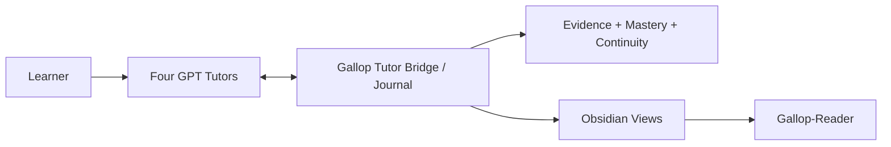

# Gallop

**A local-first, evidence-driven Progressive Mentorship Engine for mathematics, statistics/econometrics, finance, and CS/AI.**

[简体中文](README.md) · [Quickstart](docs/quickstart.md) · [Architecture](docs/architecture.md) · [Current status](docs/current-status.md) · [Roadmap](docs/roadmap.md) · [Security](SECURITY.md) · [Apache-2.0](LICENSE)

> **Current source baseline: Gallop v1.2.0 — Zero-Touch Learning Continuity.** Four subject-bound GPT Tutor conversations are the learner-facing surface; Gallop runs underneath them to govern the Journal, evidence authority, continuity, mastery, and Obsidian/Reader projections. Controlled four-Tutor real dogfood passed on 2026-09-14. GitHub Release metadata is intentionally left unchanged; repository source status and Release records are managed separately.

## Core principle

> **GPT = TEACH · GALLOP = GOVERN · OBSIDIAN = REMEMBER · EVIDENCE = PROVE**

Gallop does not treat “the GPT says you mastered it” as mastery. Real learning activity is recorded as replayable, auditable evidence: concepts, mistakes, hints, independent work, repairs, retests, checkpoints, and final state live in a local Journal. Obsidian and Gallop-Reader are derived views, never the authority.

## What v1.2 implements

| Capability | Current state | Boundary |
|---|---|---|
| Four-Tutor Zero-Touch | Mathematics / Statistics / Finance / CS-AI subject-bound GPT Tutor MCP servers | A Tutor can only access and write its own subject context |
| Fresh-chat continuity | A new chat can restore bounded context from the Journal using a stable session identity | No dependency on the old transcript or model memory as authority |
| Incremental checkpointing | Meaningful learning work is committed incrementally and can survive abrupt exit | Journal commits precede projection refresh |
| Evidence authority | Distinguishes independent, hinted, solution-seen, AI-generated, and other evidence classes | Tutor assessment is candidate evidence until accepted by the authority flow |
| Progressive Mentorship | Uses current capability, target, prerequisites, productive struggle, and scaffolding to shape guidance | Targets never raise current capability; scaffolding fades conservatively |
| Obsidian projection | Automatically projects Gallop-owned Session / Concept / Mistake / Home views | Journal is authoritative; unsafe managed-region loss fails closed |
| Gallop-Reader | Validated one-way PC → Vault → Reader publication with recovery | Reader is a reading mirror, not bidirectional state |
| Recovery / idempotency | Abrupt-close restore, exact duplicate recovery, deterministic replay | Duplicate events do not become duplicate learning evidence |
| Legacy compatibility | Automation V1 and v0.1 workflows remain available | Historical mastery is not silently migrated or reinterpreted |

## Real acceptance

The [v1.2 Real Four-Tutor Dogfood Acceptance](docs/audits/v1.2-real-dogfood-acceptance.md) covers:

- four real subject-bound Tutor sessions;
- Mathematics proof → mistake → assisted repair → fresh-chat independent retest;
- Statistics simulation reasoning;
- Finance closed-book derivation;
- CS/AI No-Agent Coding;
- abrupt-close restore and exact duplicate checkpoint recovery;
- automatic Obsidian projection and fail-closed projection recovery;
- one-way Gallop-Reader publication with learner-confirmed mobile visibility;
- four-subject isolation and conservative evidence authority.

Acceptance deliberately preserved weak outcomes instead of hiding them: when the Mathematics independent retest was `PARTIAL`, Gallop kept the state at `GUIDED`, mastery `0`, rather than lowering the evidence standard to improve a release claim.

## Daily-use shape

Normal learning does not require a separate Gallop UI:



The learner studies directly in the relevant Tutor conversation. The subject-bound bridge opens or restores a session, returns bounded context, records learning events, checkpoints, and finalization. Gallop maintains the append-only Journal, deterministic replay, and evidence authority; Obsidian and Reader present the derived state.

DeepTutor is now an **optional legacy adapter**. It is not on the v1.2 critical path and is not a required runtime dependency for Zero-Touch continuity.

## Isolated offline example

Requires Python 3.11+:

```bash
git clone https://github.com/lucaschang2021/gallop.git
cd gallop
python -m venv .venv
python -m pip install -e ".[dev]"
python -m gallop demo --output demo-output
```

Development and regression checks:

```bash
ruff check gallop tests scripts
mypy
pytest
python scripts/verify_v1_replay.py
python scripts/validate_examples.py
python scripts/check_architecture.py
python scripts/audit_repository.py
```

CI covers Windows / Ubuntu × Python 3.11 / 3.13 and runs tests, Ruff, Mypy, V1 replay, example validation, architecture and privacy gates, the offline demo, and a wheel build.

## Code map

```text
gallop/
├── ARCHITECTURE.toml       # executable architecture contract and drift baseline
├── gallop/tutor/            # v1.2 Tutor Protocol, Bridge, Context, Evidence, MCP
├── gallop/projections/      # Tutor/Obsidian derived views
├── gallop/automation/       # Journal, state, jobs, CLI, and legacy Automation
├── gallop/progression/      # pure capability / zone / scaffolding / evidence logic
├── gallop/mentorship/       # Progressive Mentorship policy facade
├── gallop/adapters/         # Obsidian, DeepTutor, and other adapter boundaries
├── gallop/schemas/          # Tutor / evidence / capability protocol schemas
├── tests/                   # unit, Golden E2E, MCP, recovery, architecture, privacy
├── scripts/                 # replay, examples, architecture, repository audit
└── docs/                    # governance, baselines, acceptance, operations
```

## Data, safety, and evidence

- Real learning data, answers, Journal state, configuration, and local paths should never be committed to the repository.
- Synthetic fixtures and offline demos never enter learner authority state.
- Human confirmation is not identity verification or proctoring; Gallop is not a validated educational measurement instrument.
- Mastery advances only from evidence admitted by the rules; assisted work, solution-seen work, AI-generated work, and independent work remain distinct.
- Data sent to external services depends on explicit adapter configuration; v1.2 continuity itself does not require DeepTutor.

Read [Security](SECURITY.md), [Architecture Governance](docs/architecture-governance.md), the [v1.2 Tutor Protocol](docs/v1.2-tutor-protocol.md), [Progressive Mentorship](docs/progressive-mentorship.md), and [Current Status](docs/current-status.md).

## Engineering status

The real four-Tutor integration and controlled daily-use path have passed dogfood. Remaining work is primarily continued daily use, regression stability, first-time onboarding, evidence calibration, and broader environment coverage—not another redesign of the core product.

GitHub Release metadata remains unchanged for now; this README describes repository source and controlled acceptance status. See [Current Status](docs/current-status.md) and the [Roadmap](docs/roadmap.md).

## License

Gallop uses the [Apache License 2.0](LICENSE). Third-party models, applications, and services retain their own terms.
