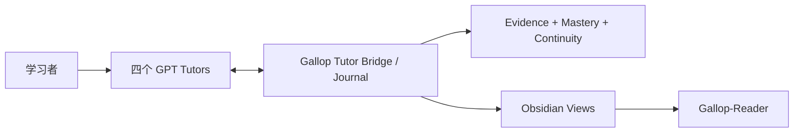

# Gallop

**面向数学、统计/计量、金融与 CS/AI 的本地优先、证据驱动 Progressive Mentorship Engine。**

[English](README.en.md) · [快速开始](docs/quickstart.md) · [架构](docs/architecture.md) · [当前状态](docs/current-status.md) · [Tutor Protocol](docs/v1.2-tutor-protocol.md) · [路线图](docs/roadmap.md) · [安全](SECURITY.md) · [Apache-2.0](LICENSE)

> **当前源码基线：Gallop v1.2.0 — Zero-Touch Learning Continuity。** 四个 subject-bound GPT Tutor 对话是学习者唯一界面；Gallop 在其下负责 Journal、evidence authority、continuity、mastery 与 Obsidian / Gallop-Reader 投影。2026-09-14 的四导师真实 dogfood 已通过。GitHub Release/tag 与源码状态分开管理。

## 核心原则

> **GPT = TEACH · GALLOP = GOVERN · OBSIDIAN = REMEMBER · EVIDENCE = PROVE**

Gallop 不把“GPT 说你会了”当作掌握。学习事件以可重放、可审计的证据写入本地 Journal：概念暴露、错误、提示、独立作答、修复、重测、checkpoint 与 session finalization 都有稳定身份和来源。Obsidian 与 Gallop-Reader 是派生视图，不是权威状态。

## v1.2 已实现

| 能力 | 当前状态 | 关键边界 |
|---|---|---|
| Four-Tutor Zero-Touch | Mathematics / Statistics & Econometrics / Finance / CS & AI 四个 subject-bound GPT Tutor MCP | Tutor 只能访问自己的 subject context |
| Fresh-chat continuity | 新对话可凭稳定 session identity 从 Journal 恢复有界上下文 | 不依赖旧 transcript 或模型记忆作为权威 |
| Incremental checkpointing | 有意义的学习进度增量提交，可从异常退出恢复 | Journal commit 先于投影刷新 |
| Evidence authority | 区分独立、提示、看答案、AI 生成等证据类型 | Tutor assessment 先是 candidate evidence，不直接升级 mastery |
| Progressive Mentorship | 依据 current capability、target、prerequisite、productive struggle 与 scaffolding 给出训练指导 | target 永远不会抬高 current capability |
| Obsidian projection | 自动生成受管 Session / Concept / Mistake / Home 视图 | Journal 是 source of truth；所有权异常 fail closed |
| Gallop-Reader | PC → Vault → Reader 单向发布与恢复已验证 | Reader 是阅读镜像，不做双向权威同步 |
| Recovery / idempotency | abrupt-close restore、exact duplicate recovery、deterministic replay | 重复事件不会重复计入学习证据 |
| Legacy compatibility | Automation V1 与 v0.1 流程保留 | 历史 mastery 不静默迁移或重解释 |

## 真实验收

[v1.2 Real Four-Tutor Dogfood Acceptance](docs/audits/v1.2-real-dogfood-acceptance.md) 已覆盖：

- 四个真实 subject-bound Tutor session；
- 数学证明 → 错误诊断 → assisted repair → fresh-chat closed-book retest；
- 统计 fixed-seed simulation reasoning；
- 金融 closed-book derivation；
- CS/AI `NO_AGENT_CODING`；
- abrupt-close restore 与 duplicate checkpoint recovery；
- 自动 Obsidian projection、fail-closed projection recovery；
- Gallop-Reader 单向发布、恢复与手机端可见性；
- 四学科隔离、candidate evidence / human attestation 权限边界。

验收没有为了“好看”而放宽标准：数学独立重测结果为 `PARTIAL` 时，系统保持 `GUIDED`、mastery `0`，而不是伪造升级。

## 日常使用形态



日常学习直接发生在对应 Tutor 对话中。Tutor Bridge 打开/恢复 session，返回有界 context，记录 learning events、checkpoint 与 finalization。Gallop 维护 append-only Journal、deterministic replay 和 evidence authority；Obsidian/Reader 负责阅读与回顾。

**DeepTutor 现在是可选 legacy adapter，不在 v1.2 critical path 上。**

## 隔离离线示例

需要 Python 3.11+：

```bash
git clone https://github.com/lucaschang2021/gallop.git
cd gallop
python -m venv .venv
python -m pip install -e ".[dev]"
python -m gallop demo --output demo-output
```

完整的 Automation V1 / legacy CLI 仍可用于测试、迁移兼容与开发。不要把 synthetic demo 当成真实 learner evidence。详见[快速开始](docs/quickstart.md)和[CLI](docs/automation-cli.md)。

## 工程边界

- `gallop/tutor/`：v1.2 Tutor Protocol、Runtime Bridge、bounded context、MCP transport。
- `gallop/automation/`：Journal/application orchestration、replay、queue、views、durable jobs。
- `gallop/progression/`：无 I/O 的 Progressive Mentorship 决策域。
- `gallop/projections/`：v1.2 Tutor/Obsidian projection。
- `gallop/schemas/`：协议、证据、readiness、target、prerequisite 等 schema。
- `ARCHITECTURE.toml` + `scripts/check_architecture.py`：可执行架构约束与漂移门禁。
- `.github/workflows/tests.yml`：Windows/Ubuntu × Python 3.11/3.13 的 Ruff、Mypy、pytest、V1 exact replay、examples、architecture、privacy audit、demo 与 wheel build。

## 安全与证据

- 私有 Journal、真实答案、provider runtime、配置与凭据不得进入仓库或 Reader。
- Tutor assessment 不是 human attestation；Obsidian edit 不是 progression mutation。
- 独立证据必须遵守 assistance / agent-usage 约束；AI 生成代码不能算 independent coding evidence。
- 本地 hash-chain / SQLite trigger 用于一致性与意外损坏检测，不是对机器所有者的防篡改证明。
- Reader 过滤是 defense in depth，不承诺识别所有敏感文本。

详见[架构](docs/architecture.md)、[v1.2 Tutor Protocol](docs/v1.2-tutor-protocol.md)、[真实集成](docs/v1.2-real-tutor-integration.md)、[安全规则](docs/automation-safety.md)与[当前状态](docs/current-status.md)。

## 当前工程状态

`gallop-learning` 源码版本为 `1.2.0`。v1.2 已完成受控真实 dogfood；此前 main 的完整 Windows/Ubuntu × Python 3.11/3.13 CI matrix 已全绿。发布页面、tags、PyPI/asset 分发是独立的 release-management 问题，不应与源码能力或 dogfood acceptance 混为一谈。

下一阶段以 **稳定日用、真实学习证据积累、回归监控与小步维护** 为主，而不是继续扩张架构。Competition Mathematics / Yau specialization、语义检索、通用 plugin ecosystem、Gallop UI 等都不属于 v1.2 baseline。

## License

Gallop 使用 [Apache License 2.0](LICENSE)。第三方工具与服务遵循各自条款。