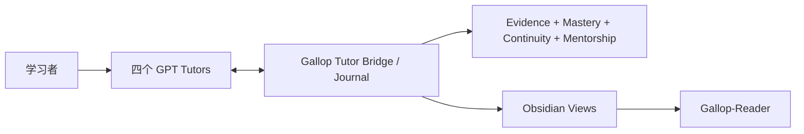

# Gallop

**面向数学、统计/计量、金融与 CS/AI 的本地优先、证据驱动 Progressive Mentorship Engine。**

[English](README.en.md) · [能力与边界](docs/capabilities-and-boundaries.md) · [快速开始](docs/quickstart.md) · [架构](docs/architecture.md) · [当前状态](docs/current-status.md) · [Tutor Protocol](docs/v1.2-tutor-protocol.md) · [路线图](docs/roadmap.md) · [安全](SECURITY.md) · [Apache-2.0](LICENSE)

> **当前源码基线：Gallop v1.2.0 — Zero-Touch Learning Continuity。** 四个 subject-bound GPT Tutor 对话是学习者界面；Gallop 在其下负责 Journal、evidence authority、continuity、mastery/readiness、Progressive Mentorship 与 Obsidian / Gallop-Reader 投影。2026-09-14 的四导师真实 dogfood 已通过。GitHub Release/tag 与源码状态分开管理。

## 核心原则

> **GPT = TEACH · GALLOP = GOVERN · OBSIDIAN = REMEMBER · EVIDENCE = PROVE**

Gallop 不把“GPT 说你会了”当作掌握。学习事件以可重放、可审计的证据写入本地 Journal：概念暴露、错误、提示、独立作答、修复、重测、checkpoint 与 session finalization 都有稳定身份和来源。Obsidian 与 Gallop-Reader 是派生视图，不是权威状态。

## 已有能力全景

Gallop v1.2 不是只有 Four-Tutor bridge。当前仓库已经同时保留并治理下面这些能力：

| 能力层 | 已有能力 | 当前定位 / 边界 |
|---|---|---|
| Learner surface | Mathematics / Statistics & Econometrics / Finance / CS & AI 四个 subject-bound GPT Tutor MCP | 四导师是主学习界面；每个 Tutor 只能访问自己的 subject context |
| Session continuity | 稳定 session/event identity、open/resume、record、checkpoint、finalize、readback | exact retry 幂等；同 ID 不同内容 fail closed |
| Fresh-chat continuity | 新对话可从 Journal 恢复有界上下文 | 不依赖旧 transcript 或模型记忆作为权威 |
| Recovery | incremental checkpoint、abrupt-close restore、projection recovery | Journal commit 先于投影；投影失败不抹掉已提交证据 |
| Journal / Replay | append-only Journal、deterministic replay、hash/integrity guards | Journal 是 source of truth；derived cache 可重建 |
| Evidence authority | observation / attempt / candidate assessment / human attestation / independent / assisted / solution-seen / AI-assisted/generated 等来源区分 | Tutor/model/provider 输出不能直接升级 mastery |
| Mastery / Readiness | conservative mastery、confidence、evidence refs、readiness profiles | 一次正确、一句夸奖、model score 都不能直接构成 mastery |
| Elite evidence | task type、quality、hint、agent provenance、transfer、failure mode、benchmark、prerequisite link | 不合并成黑盒总分，也不预测竞赛奖项 |
| Progressive Mentorship | current capability、target gap、prerequisite diagnosis、training zone、productive struggle、scaffolding、next action、gains、mentor role、research independence | target 不抬高 current；mentorship 只建议，不暗改 scheduler/queue |
| Training policy | 四学科共用统一引擎 + subject-specific policy data | Proof / derivation / simulation / empirical / oral / paper / coding / no-agent / systems / research / benchmark 等任务均可表达 |
| Automation V1 | intake、queue/explain、prepare、start、human-confirmed ingest、cycle、replay、projection、recovery | 真实存在但属于 compatibility/developer surface，不是第二套 learner UI |
| DeepTutor bridge | durable submit / poll / collect、provider lifecycle、recovery | legacy / optional / non-authoritative；v1.2 主路径零 DeepTutor 必需依赖 |
| Legacy v0.1 | session → manifest → result → mastery、offline demo、旧 schemas/CLI | 历史流程继续可用，不静默重解释为 v1.2 证据 |
| No-Agent evidence | no-agent、closed-book、assistance/agent provenance 条件 | 是证据语义，不是技术层面的监考/防作弊系统 |
| Obsidian | Session / Concept / Mistake / Home / Development / readiness / benchmark 等受管投影 | 手工编辑投影不能成为 authority；owned region 冲突 fail closed |
| Gallop-Reader | Main Vault → Reader 单向发布、dry-run、ownership receipt、backup/recovery、mobile visibility | Reader 是阅读镜像，不做 phone → Vault 权威回写 |
| iCloud-aware safety | Windows/iCloud binding、Cloud Files metadata gate、fail-closed publish | 是安全门禁，不是通用云端 provisioning/repair engine |
| Schemas | session、practice、automation、Elite evidence、benchmark、readiness、target、prerequisite、Tutor event/directive、learning context 等 versioned schema | 非法/矛盾输入拒绝，而不是“自动猜对” |
| Governance / CI | Architecture Gate、privacy audit、V1 exact replay、pytest、Ruff、Mypy、examples、demo、wheel | Windows/Ubuntu × Python 3.11/3.13 是主 CI matrix |

完整、逐项的权威清单见 **[Existing Capabilities and Product Boundaries](docs/capabilities-and-boundaries.md)**。

## v1.2 主路径



日常学习直接发生在对应 Tutor 对话中。Tutor Bridge 打开/恢复 session，返回有界 context，记录 learning events、checkpoint 与 finalization。Gallop 维护 append-only Journal、deterministic replay、evidence authority 与 Progressive Mentorship；Obsidian/Reader 负责阅读与回顾。

**DeepTutor 现在是可选 legacy adapter，不在 v1.2 critical path 上。**

## 硬产品边界

下面这些不是“以后忘了补”，而是 v1.2 的明确边界：

- **没有单独 Gallop UI。** 四个 GPT Tutor 对话就是 learner-facing surface。
- **没有 model-as-grader authority。** GPT/provider 可以教学、观察、提交 candidate evidence，但不能直接宣告 mastery。
- **没有身份验证/监考能力。** human attestation 是显式本地确认，不是 authorship/proctoring 证明。
- **没有 autonomous curriculum owner。** Progressive Mentorship 只做 advisory；不会暗中改 target、课程表或 scheduler。
- **没有 agent swarm。** Gallop 是学习治理/连续性/证据系统，不是通用 autonomous-agent framework。
- **没有强制 DeepTutor。** DeepTutor 仅保留 legacy optional adapter。
- **没有跨学科/跨概念证据泄漏。** Math 证据不会自动变成 Finance/CS/Stats 证据，Concept A 也不会证明 Concept B。
- **没有 silent migration。** 旧 Journal/event meaning 不会为了新版叙事被静默重解释。
- **没有 psychometric validity claim。** mastery/readiness 是保守的软件治理模型，不是经过心理测量学验证的教育测量工具。
- **没有 hostile-owner tamper-proof claim。** hash-chain / SQLite trigger 用于一致性与损坏检测，不对拥有机器完全权限的人提供不可篡改保证。
- **没有 distributed atomicity claim。** Journal commit 是权威；Obsidian/Reader/cloud 多文件发布可恢复，但不是一个分布式事务。
- **没有通用 cloud provisioning。** Gallop 能在已验证的 Reader 路径上安全发布，但不负责修复任意 iCloud/Obsidian 环境。
- **没有“隐私过滤必定抓到所有敏感信息”的承诺。** repository audit 与 Reader filter 都是 defense in depth。
- **v1.2 baseline 没有 semantic retrieval / broad plugin ecosystem / Gallop UI / Yau-specific competition engine。** 这些都不是当前已有核心能力。
- **源码版本不等于发布状态。** `gallop-learning==1.2.0`、GitHub Release/tag、PyPI、assets 必须分别陈述。

## 权威边界

| Surface | 可以做 | 不可以做 |
|---|---|---|
| GPT Tutor | 教学、提问、解释、观察、提交 candidate event/assessment | 直接宣告 mastery、写其他 subject、替代 Journal |
| Tutor MCP / Runtime Bridge | 校验、记录、checkpoint、resume、给 bounded context | 绕过 evidence rules、伪造历史 |
| Journal | 保存权威 accepted events、支持 replay | 猜测未发生的 learner success |
| Evidence / mastery policy | admission、provenance、capability derivation | 把 praise / provider output / model confidence 当 mastery |
| Progressive Mentorship | 给 zone、scaffold、repair/retest、next action | 暗改 queue、降低 target ceiling、无证据认证能力 |
| Obsidian | 展示 human-readable governed projection | 通过手改 Markdown 改 authoritative state |
| Gallop-Reader | 提供移动端阅读连续性 | 向 Journal/Vault 回写权威学习状态 |
| DeepTutor / provider | 可选生成练习材料 | 成为强制依赖或独立评分 authority |

## 真实验收

[v1.2 Real Four-Tutor Dogfood Acceptance](docs/audits/v1.2-real-dogfood-acceptance.md) 已覆盖：

- 四个真实 subject-bound Tutor session；
- 数学证明 → 错误诊断 → assisted repair → fresh-chat closed-book retest；
- 统计 fixed-seed simulation reasoning；
- 金融 closed-book derivation；
- CS/AI `NO_AGENT_CODING`；
- abrupt-close restore 与 duplicate checkpoint recovery；
- 自动 Obsidian projection、fail-closed projection recovery；
- Gallop-Reader 单向发布、恢复与手机端可见性；
- 四学科隔离、candidate evidence / human attestation 权限边界。

验收没有为了“好看”而放宽标准：数学独立重测结果为 `PARTIAL` 时，系统保持 `GUIDED`、mastery `0`，而不是伪造升级。

## 隔离离线示例

需要 Python 3.11+：

```bash
git clone https://github.com/lucaschang2021/gallop.git
cd gallop
python -m venv .venv
python -m pip install -e ".[dev]"
python -m gallop demo --output demo-output
```

完整的 Automation V1 / legacy CLI 仍可用于测试、迁移兼容与开发。不要把 synthetic demo 当成真实 learner evidence。详见[快速开始](docs/quickstart.md)和[CLI](docs/automation-cli.md)。

## 工程边界

- `gallop/tutor/`：v1.2 Tutor Protocol、Runtime Bridge、bounded context、MCP transport。
- `gallop/automation/`：Journal/application orchestration、replay、queue、views、durable jobs。
- `gallop/progression/`：无 I/O 的 Progressive Mentorship 决策域。
- `gallop/projections/`：v1.2 Tutor/Obsidian projection。
- `gallop/schemas/`：协议、证据、readiness、target、prerequisite 等 schema。
- `ARCHITECTURE.toml` + `scripts/check_architecture.py`：可执行架构约束与漂移门禁。
- `.github/workflows/tests.yml`：Windows/Ubuntu × Python 3.11/3.13 的 Ruff、Mypy、pytest、V1 exact replay、examples、architecture、privacy audit、demo 与 wheel build。

## 安全与证据

- 私有 Journal、真实答案、provider runtime、配置与凭据不得进入仓库或 Reader。
- Tutor assessment 不是 human attestation；Obsidian edit 不是 progression mutation。
- 独立证据必须遵守 assistance / agent-usage 约束；AI 生成代码不能算 independent coding evidence。
- Reader 过滤是 defense in depth，不承诺识别所有敏感文本。

详见[能力与边界](docs/capabilities-and-boundaries.md)、[架构](docs/architecture.md)、[v1.2 Tutor Protocol](docs/v1.2-tutor-protocol.md)、[真实集成](docs/v1.2-real-tutor-integration.md)、[安全规则](docs/automation-safety.md)与[当前状态](docs/current-status.md)。

## 当前工程状态

`gallop-learning` 源码版本为 `1.2.0`。v1.2 已完成受控真实 dogfood；此前 main 的完整 Windows/Ubuntu × Python 3.11/3.13 CI matrix 已全绿。发布页面、tags、PyPI/asset 分发是独立的 release-management 问题，不应与源码能力或 dogfood acceptance 混为一谈。

下一阶段以 **稳定日用、真实学习证据积累、回归监控与小步维护** 为主，而不是继续扩张架构。

## License

Gallop 使用 [Apache License 2.0](LICENSE)。第三方工具与服务遵循各自条款。