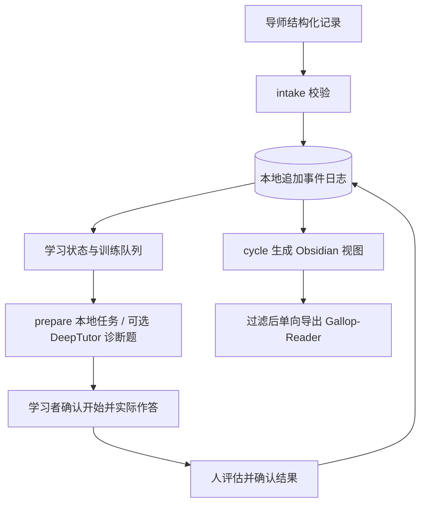

# Gallop

**把 AI 辅导中的概念、薄弱点和真实练习记录，变成可持续追踪的学习计划——一个本地优先的 Python 学习编排工具。**

[English](README.en.md) · [快速开始](docs/quickstart.md) · [架构](docs/architecture.md) · [当前状态](docs/current-status.md) · [路线图](docs/roadmap.md) · [贡献](CONTRIBUTING.md) · [安全](SECURITY.md) · [Apache-2.0](LICENSE)

> **稳定版本：v1.0.0 / Automation V1；当前候选版本：v1.1.0rc2。** 候选版本增加 Elite Training Protocol 与 Progressive Mentorship Engine，仍属早期项目，不保证学习效果。先运行隔离示例，再考虑连接真实笔记库。

## 为什么需要 Gallop？

和 AI 上完一节课，不等于掌握了知识。聊天记录会散落，薄弱点容易被忘记，一次答对也不足以证明能独立完成下一道题。

Gallop 连接三个环节：**导师记录学了什么 → 安排下一次练什么 → 根据真实表现保留证据**。学习者保留本地数据，可以查看每次状态变化的理由，并在 Obsidian 中阅读今天的训练、待复习内容和遗留问题。

例如：你在数学辅导中反复弄错连续性定义的量词顺序。导师输出结构化记录后，Gallop 保留这个薄弱点、建立训练候选项，并准备独立练习任务。你实际作答、由人确认评估后，它才按保守规则更新学习状态。仅导入课程摘要不会提升掌握度。

**AI 负责组织刻意练习，学习者仍然负责思考。** 详见[项目理念](docs/philosophy.md)。

## 适合谁？

- 希望把长期 AI 辅导与复习连接起来的自学者、学生和研究者。
- 使用 Obsidian、愿意通过命令行管理学习记录的用户。
- 想接入结构化导师输出或练习引擎的开发者。

当前 Automation 策略覆盖数学、统计/计量、金融、CS/AI。基础协议可以扩展，但新增学科需要相应策略与验证，不是任意学科开箱即用。它也不是开箱即用的在线课程平台或自动评分系统。

## 已有能力与边界

| 能力 | 当前实现 | 需要知道的边界 |
|---|---|---|
| 导师记录接入 | 从 JSON 或协议 Markdown 导入课程、概念、错误和问题，保留原始输入 | 不抓取 ChatGPT 账号；需要符合[导师协议](docs/tutor-protocol.md)的文件 |
| 持久学习状态 | SQLite 追加事件、确定性重放、状态变化解释与证据引用 | Automation 日志是新数据的依据，不自动迁移旧掌握度 |
| 训练与复习 | 四学科策略、P0–P4 优先级、T+1/T+7/T+30 复习候选项 | 手动调用命令，无后台守护进程或自动提醒 |
| 练习准备 | 本地任务说明；可选 DeepTutor 诊断题及持久 submit/poll/collect 任务 | DeepTutor 单独安装；当前选择题不能代替证明、口试、编程或模拟实验 |
| 掌握度评估 | 根据人确认的真实结果更新 0–5 级状态与 low/medium/high 置信度 | 生成题目不等于完成训练；一次答对不会自动升级 |
| 精英训练与渐进指导（v1.1 RC） | 区分独立、提示、看过答案和 AI 生成证据；根据显式目标与当前证据给出训练区间、支架和先修修复建议 | 目标不会抬高当前能力；建议不直接调度任务，Human Production E2E 尚待执行 |
| 笔记与手机阅读 | Obsidian Markdown 受管区域、过滤后的单向 Gallop-Reader 导出 | Reader 是阅读镜像，不是双向同步；真实发布依赖现有已验证的 Reader 绑定 |
| 兼容旧流程 | 保留 v0.1 的 session/manifest/generate/import-result 和离线 demo | 旧流程的配置、状态和掌握度规则与 Automation 分开 |

## 先跑一个不联网的示例

需要 **Python 3.11+** 和 Git；CI 覆盖 Windows/Ubuntu、Python 3.11/3.13。示例不需要 Obsidian、DeepTutor、模型账号或 API key。

```bash
git clone https://github.com/lucaschang2021/gallop.git
cd gallop
python -m venv .venv
```

激活环境：PowerShell 使用 `.venv\Scripts\Activate.ps1`；Linux/macOS 使用 `source .venv/bin/activate`。然后安装：

```bash
python -m pip install -e .
python -m gallop --help
python -m gallop --automation-config examples/automation/config.json intake examples/automation/session.json
python -m gallop --automation-config examples/automation/config.json queue
python -m gallop --automation-config examples/automation/config.json cycle
python -m gallop --automation-config examples/automation/config.json status
python -m gallop --automation-config examples/automation/config.json explain Continuity --subject mathematics
```

这个虚构的连续性课程示例会创建一个概念与训练候选项，**掌握度保持 0、置信度 low，训练不会自动开始或完成**。重复导入同一文件不会重复记为学习证据。

生成内容全部位于仓库内被忽略的 `automation-runtime/integration_tests/`：

```text
automation-runtime/integration_tests/
├── events.sqlite3          # 原始输入和追加事件，重放依据
├── derived-state.json      # 可重建的学习状态
├── vault/Today.md          # 今天的训练、薄弱点和问题
├── vault/Gallop/Automation/
└── reader/Gallop-Reader/    # 本地阅读预览，不连接真实云端
```

首次使用要求配置中的运行根目录为空；不要把它改成真实 Vault。配置路径相对于 JSON 配置文件解析，Automation 不读取旧流程的 `.env`。

若想看完整的旧版模拟练习闭环：

```bash
python -m gallop demo --output demo-output
```

该 **legacy 合成示例**生成 7 道题、虚构 5/7 成绩和 1 → 2 状态变化，只写入 `integration_tests`；它不是真实成绩，也不代表 Automation 的升级规则。详细操作见[快速开始](docs/quickstart.md)。

## 实际学习如何进行？



1. 导入导师记录，用 `queue` 和 `explain` 查看下一步及其依据。
2. `prepare QUEUE_ID` 准备本地任务；需要外部诊断题时显式调用 `prepare QUEUE_ID --send`，再用返回的 job ID 执行 `poll` / `collect`。
3. 学习者真正开始时才执行 `start QUEUE_ID --confirm`，按实际表现填写结果模板。
4. 人评估后执行 `ingest-result FILE --confirm-human`；再运行 `cycle` 更新视图与 Reader。

以上 Automation 命令都要先带 `--automation-config FILE`。真实模式需要已有 Obsidian Vault；`publish` / `cycle` 还要求现有已验证的 Reader 绑定。首次体验请停留在隔离示例，不要创建替代 Reader 或重置导出回执。完整步骤见 [Automation V1](docs/automation-v1.md) 和 [CLI](docs/automation-cli.md)。

## 数据、安全与学习证据

- 原始记录、事件日志、任务输出和答案文件保存在本地私有运行目录；Obsidian 是可读视图。不要提交真实笔记、作答、配置、凭据或运行日志。
- 外部模型调用需要显式请求，会把选定的练习上下文交给 DeepTutor 配置的服务。`cycle` 不调用模型，也不替学习者作答。
- 最高掌握度要求跨天、独立、多种任务、延迟回忆、迁移和口试证据。规则是软件中的保守启发式，不是经验证的教育测量工具。
- 人确认不是监考或身份认证；本地哈希链不是对机器所有者的防篡改保证。导出过滤也不能保证识别所有敏感文字。

参阅[安全策略](SECURITY.md)、[Automation 掌握度规则](docs/automation-safety.md)、[Elite Training Protocol](docs/elite-training-protocol.md)、[Progressive Mentorship](docs/progressive-mentorship.md)及 [Reader 边界](docs/mobile-export.md)。

## 代码地图与工程状态

```text
gallop/
├── ARCHITECTURE.toml       # 可执行架构契约与漂移基线
├── gallop/automation/       # 接入、事件库、状态、队列、任务恢复、视图、CLI
├── gallop/progression/      # 无 I/O 的能力、训练区间、支架与指导决策
├── gallop/adapters/         # DeepTutor、Obsidian、离线 mock
├── gallop/core/             # 旧流程的校验、同步、掌握度和复习
├── gallop/schemas/          # JSON 协议与四学科策略
├── gallop/mobile.py         # 过滤后的单向阅读导出
├── examples/               # 合成课程和练习输入
├── tests/                  # 单元、掌握度、安全和集成测试
├── scripts/                # 示例校验与 Git 历史隐私审计
└── .github/workflows/       # Windows/Ubuntu CI 与 wheel 构建检查
```

CI 对 push/PR 运行测试、示例校验、仓库审计、离线 demo 和 wheel 构建。v1.0.0 的发布记录报告了 177 项本地测试及一次隔离的真实 DeepTutor 验证；这不证明所有环境、模型或长期学习效果都已验证。

架构依赖、证据权限、时间输入和热点文件增长由
[Architecture Governance](docs/architecture-governance.md) 与 CI 中的可执行 Gate 约束。

截至 2026-08-31，v1.0.0 GitHub Release 没有附加 wheel/checksum 资产，当前 CI 也不自动上传发布资产。请使用上面的源码安装方式；不要把 v0.1.0 wheel 当成 v1.0.0。[当前状态与证据](docs/current-status.md)区分已实现、历史验证和待完善项。

## 后续方向与参与方式

优先完善发布可复现性、真实环境接入说明、证据校准与外部贡献体验；语义检索、动态难度和更多适配器属于后续探索，不是当前承诺。详见[路线图](docs/roadmap.md)。

欢迎提交可复现 bug、文档改进、合成学习样例和聚焦的适配器 PR。开发者安装 `python -m pip install -e ".[dev]"` 后，按 [CONTRIBUTING.md](CONTRIBUTING.md) 运行与 CI 一致的检查。漏洞请按 [SECURITY.md](SECURITY.md) 私下报告，不要在公开 issue 中上传真实学习数据。

## License

Gallop 使用 [Apache License 2.0](LICENSE)。DeepTutor 是独立外部项目，未随 Gallop 分发；第三方代码和服务遵循各自条款。参阅[依赖边界](docs/dependencies.md)。
