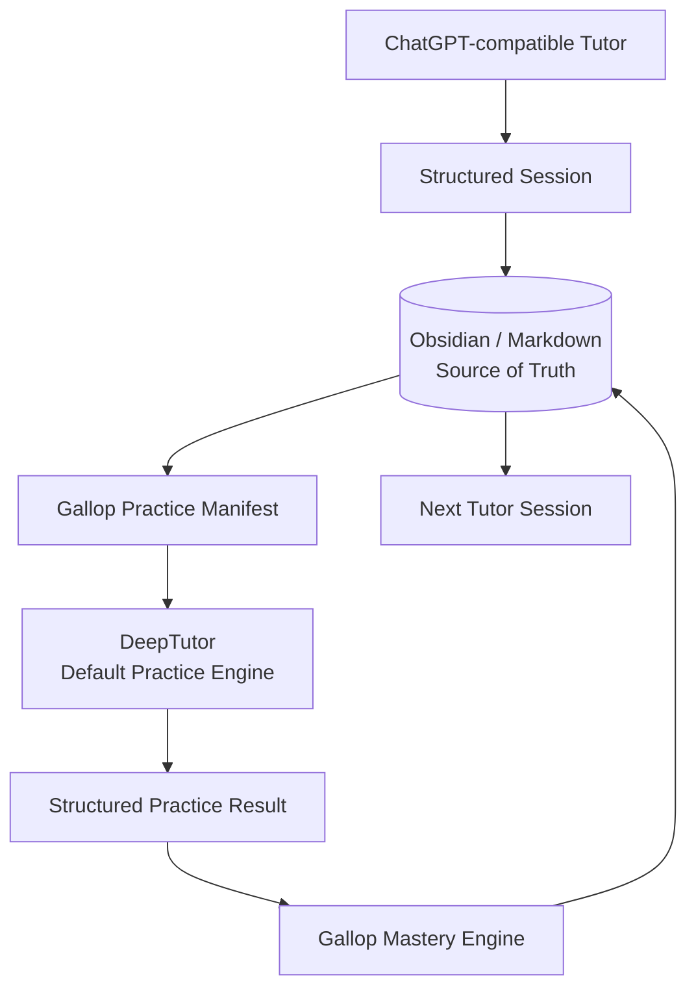

# Gallop

**Persistent AI tutoring without outsourcing thinking.**

Gallop is a local-first orchestration framework for AI tutoring, deliberate
practice, mastery tracking, and research-oriented learning.

> Use AI to make learning harder in the right ways, not easier in the wrong ways.

Gallop connects a teacher, a user-owned knowledge store, a practice engine, and
an evidence-based mastery model. It is an early open-source release, not a
production-ready learning platform and not a claim of guaranteed mastery.

## Why Gallop?

AI conversations are easy to lose, quiz scores are easy to overinterpret, and
practice tools rarely own the learner's long-term context. Gallop keeps durable
state in Markdown, sends a minimal practice manifest to a replaceable practice
engine, and imports structured evidence under conservative mastery rules.

## Core philosophy

- AI organizes deliberate practice; the learner still performs the thinking.
- Productive struggle comes before hints.
- One correct answer is not robust mastery.
- Knowledge and review state remain local and user-controlled.
- Adapters create replaceable boundaries without turning v0.1 into a plugin framework.

Read [the full philosophy](docs/philosophy.md).

## Architecture



The five layers are Teacher, Knowledge, Practice, Mastery, and Integration.
DeepTutor is an external default practice-engine implementation; it is not
vendored into or redistributed with Gallop. See [architecture](docs/architecture.md).

## How it works

1. A tutor emits a truthful structured session.
2. The Markdown knowledge store retains the canonical learning state.
3. Gallop builds a minimal practice manifest from observed weaknesses.
4. A practice engine generates appropriately difficult work.
5. Gallop imports the result and evaluates evidence conservatively.
6. The Markdown adapter writes the result and T+1/T+7/T+30-compatible state.

## Quickstart

Requires Python 3.11 or newer.

```bash
git clone https://github.com/lucaschang2021/gallop.git
cd gallop
python -m venv .venv
# Activate: source .venv/bin/activate (Linux/macOS)
# PowerShell: .venv\Scripts\Activate.ps1
python -m pip install -e ".[dev]"
python -m gallop demo --output demo-output
pytest
```

The demo is deterministic, offline, synthetic, and isolated under the
`integration_tests` namespace. Inspect:

- `demo-output/Gallop/Practice/integration_tests/`
- `demo-output/.gallop/mastery.json`

For Obsidian and DeepTutor configuration, continue with the
[step-by-step quickstart](docs/quickstart.md).

## Public demo

The fictional mathematics demo shows:

```text
Initial mastery 1
  -> 7 synthetic epsilon-delta practice questions
  -> example result 5/7 with one hint
  -> conservative mastery transition 1 -> 2
  -> Markdown writeback in integration_tests
```

No real learner notes, scores, history, or account state are included.

## Mastery model

| Level | Meaning |
|---:|---|
| 0 | unseen |
| 1 | exposed |
| 2 | basic understanding |
| 3 | guided application |
| 4 | independent application |
| 5 | robust mastery |

Level 5 requires repeated independent success, delayed recall, transfer, and
oral evidence. A single quiz is capped below robust mastery. See
[mastery model](docs/mastery-model.md).

## Supported components

- Tutor input: ChatGPT-compatible structured session output
- Knowledge store: Obsidian or ordinary Markdown directories
- Practice engine: DeepTutor adapter, plus deterministic mock for tests
- Review: knowledge-store-owned T+1/T+7/T+30 compatibility
- Protocols: session, practice manifest, practice result, mastery state

Embedding is optional. Without embeddings, tutor sync, practice generation,
mastery evaluation, and Markdown writeback work. Embeddings mainly improve
semantic retrieval over large material collections.

## Example learning profiles

- Mathematics: proof, hard problems, oral exams, weakness tracking
- Statistics and econometrics: estimators, simulation labs, identification
- Finance: model derivation and paper seminars
- CS/AI: no-agent coding, algorithms, systems, and machine learning

These are examples only; the core is subject-independent.

v0.1 provides a file/CLI structured-session importer, not a background ChatGPT
account scraper. DeepTutor's default transport generates diagnostic choice
questions; proof and oral assessment remain tutor-led. Stored practice IDs
prevent replays from becoming repeated mastery evidence. Confidence is unknown
(`null`) until a calibrated model exists.

## Privacy and local-first operation

Gallop sends only the data selected for a practice manifest. Never commit a
Vault, `.env`, OAuth state, generated learner history, or local DeepTutor data.
Read [SECURITY.md](SECURITY.md) before connecting a real knowledge store.

## Roadmap

See [docs/roadmap.md](docs/roadmap.md). v0.1 focuses only on the trustworthy
Tutor → Knowledge → Practice → Mastery → Knowledge loop.

## Contributing

Bug reports, schemas, learning examples, and focused adapters are welcome. See
[CONTRIBUTING.md](CONTRIBUTING.md).

## License

Gallop is licensed under Apache-2.0. DeepTutor is a separate Apache-2.0 project;
Gallop invokes it through an adapter and does not copy its implementation.
