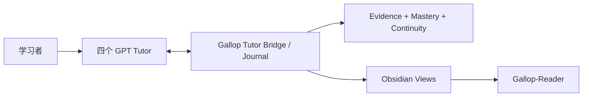

# Gallop

**一个面向数学、统计/计量、金融与 CS/AI 的本地优先、证据驱动 Progressive Mentorship Engine。**

[English](README.en.md) · [快速开始](docs/quickstart.md) · [架构](docs/architecture.md) · [当前状态](docs/current-status.md) · [路线图](docs/roadmap.md) · [安全](SECURITY.md) · [Apache-2.0](LICENSE)

> **当前源码基线：Gallop v1.2.0 — Zero-Touch Learning Continuity。** 四个 subject-bound GPT Tutor 对话是唯一学习者界面；Gallop 在后台负责 Journal、证据权限、连续性、mastery 与 Obsidian/Reader 投影。2026-09-14 的真实四导师 dogfood 已通过。GitHub Release 暂不更新，当前仓库源码状态与 Release 记录分开管理。

## 核心原则

> **GPT = TEACH · GALLOP = GOVERN · OBSIDIAN = REMEMBER · EVIDENCE = PROVE**

Gallop 不把“GPT 说你会了”当成掌握。它把真实学习过程记录为可重放、可审计的证据：概念、错误、提示、独立作答、修复、复测、checkpoint 与最终状态都进入本地 Journal；Obsidian 与 Gallop-Reader 只是派生视图，不是权威来源。

## v1.2 已实现

| 能力 | 当前状态 | 关键边界 |
|---|---|---|
| 四导师 Zero-Touch | Mathematics / Statistics / Finance / CS-AI 四个 subject-bound GPT Tutor MCP | Tutor 只能访问本学科上下文，不允许跨学科写入 |
| Fresh-chat continuity | 新对话仅凭稳定 session identity 即可从 Journal 恢复有界上下文 | 不依赖旧聊天记录，不把模型记忆当权威 |
| Incremental checkpoint | 有意义的学习事件可增量提交，支持意外退出后的恢复 | Journal 先提交，投影后刷新 |
| Evidence authority | 区分 independent / hinted / solution-seen / AI-generated 等证据 | Tutor 评估先是 candidate evidence；没有证据就不升级 mastery |
| Progressive Mentorship | 根据 current capability、target、先修、productive struggle 与支架水平给出训练建议 | Target 不会抬高当前能力；支架逐步递减 |
| Obsidian projection | 自动生成受 Gallop 管理的 Session / Concept / Mistake / Home 等视图 | Journal 是 authority；手工删除受管区域时 fail-closed |
| Gallop-Reader | PC → Vault → Reader 单向发布，支持验证后的恢复 | Reader 是只读镜像，不做手机反向写入 |
| Recovery / idempotency | abrupt-close restore、exact duplicate recovery、deterministic replay | 重复事件不会重复计入学习证据 |
| Legacy compatibility | 保留 Automation V1 与旧 v0.1 流程 | 不自动迁移或重解释历史 mastery |

## 真实验收

[v1.2 Real Four-Tutor Dogfood Acceptance](docs/audits/v1.2-real-dogfood-acceptance.md) 已覆盖：

- 四个真实 subject-bound Tutor session；
- 数学 proof → mistake → assisted repair → fresh-chat independent retest；
- 统计 simulation reasoning；
- 金融 closed-book derivation；
- CS/AI No-Agent Coding；
- abrupt-close restore、exact duplicate checkpoint recovery；
- 自动 Obsidian 投影与 fail-closed projection recovery；
- Gallop-Reader 单向发布与手机端可见性；
- 四学科隔离与保守 evidence authority。

验收刻意保留失败/部分成功结果：数学独立复测为 `PARTIAL` 时，系统保持 `GUIDED`、mastery `0`，没有为了发布而降低证据标准。

## 日常使用形态

正常情况下，学习者不需要操作一个单独的 Gallop UI：



学习者直接在对应 Tutor 对话中学习。Tutor 通过 subject-bound bridge 打开/恢复 session、读取有界 context、记录学习事件、checkpoint 和 finalize。Gallop 保持 append-only Journal、确定性重放与证据权限；Obsidian/Reader 自动呈现结果。

DeepTutor 现在是**可选 legacy adapter**，不在 v1.2 核心路径上，也不是运行时必需依赖。

## 隔离离线示例

需要 Python 3.11+：

```bash
git clone https://github.com/lucaschang2021/gallop.git
cd gallop
python -m venv .venv
python -m pip install -e ".[dev]"
python -m gallop demo --output demo-output
```

开发与回归验证：

```bash
ruff check gallop tests scripts
mypy
pytest
python scripts/verify_v1_replay.py
python scripts/validate_examples.py
python scripts/check_architecture.py
python scripts/audit_repository.py
```

CI 覆盖 Windows / Ubuntu × Python 3.11 / 3.13，并执行测试、Ruff、Mypy、V1 replay、示例、架构与隐私 Gate、离线 demo 和 wheel build。

## 代码地图

```text
gallop/
├── ARCHITECTURE.toml       # 可执行架构契约与漂移基线
├── gallop/tutor/            # v1.2 Tutor Protocol、Bridge、Context、Evidence、MCP
├── gallop/projections/      # Tutor/Obsidian 派生视图
├── gallop/automation/       # Journal、状态、任务、CLI 与 legacy Automation
├── gallop/progression/      # pure capability / zone / scaffolding / evidence logic
├── gallop/mentorship/       # Progressive Mentorship policy facade
├── gallop/adapters/         # Obsidian、DeepTutor 等适配边界
├── gallop/schemas/          # Tutor / evidence / capability 等协议 schema
├── tests/                   # 单元、Golden E2E、MCP、恢复、架构与隐私测试
├── scripts/                 # replay、示例、架构与仓库审计
└── docs/                    # governance、baseline、acceptance 与操作文档
```

## 数据、安全与证据

- 学习数据、真实作答、Journal、配置与本地路径不应提交到仓库。
- synthetic fixture 与 offline demo 永远不进入 learner authority state。
- Human confirmation 不是身份认证或监考；Gallop 也不是经临床/教育学验证的测量工具。
- mastery 只接受符合规则的证据推进；辅助完成、看过答案、AI 生成内容与独立完成严格区分。
- 外部服务是否接收数据取决于显式适配器配置；v1.2 核心 continuity 不需要 DeepTutor。

参阅 [Security](SECURITY.md)、[Architecture Governance](docs/architecture-governance.md)、[Tutor Protocol](docs/v1.2-tutor-protocol.md)、[Progressive Mentorship](docs/progressive-mentorship.md) 与 [Current Status](docs/current-status.md)。

## 当前工程状态

v1.2 的真实四导师集成和日常使用路径已经通过受控 dogfood；剩余工作主要是持续日用、回归稳定性、首次安装体验、证据校准与更广泛环境覆盖，而不是重新设计核心产品。

GitHub Release 暂时保持现状；本 README 描述的是仓库源码与受控验收状态。详见 [Current Status](docs/current-status.md) 与 [Roadmap](docs/roadmap.md)。

## License

Gallop 使用 [Apache License 2.0](LICENSE)。第三方模型、应用和服务遵循各自条款。
