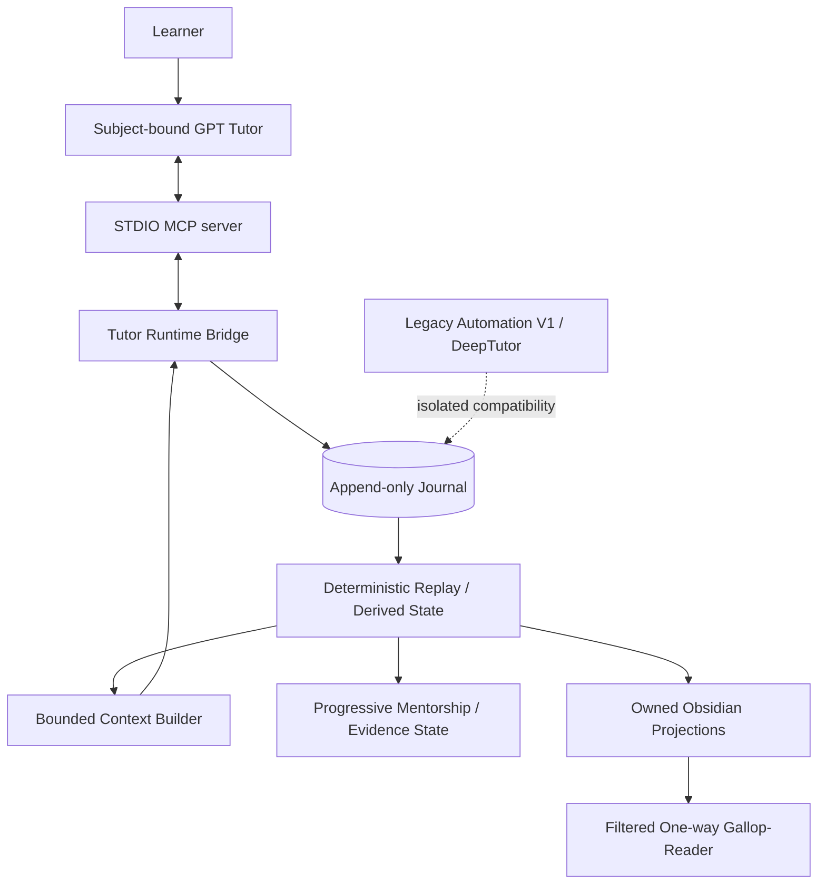

# Architecture

[Home](../README.en.md) · [Capabilities & boundaries](capabilities-and-boundaries.md) · [Current status](current-status.md) · [Quickstart](quickstart.md) · [Tutor Protocol](v1.2-tutor-protocol.md)

Gallop is a **headless local learning control plane**. In v1.2, the four GPT Tutor conversations are the learner-facing surface; Gallop runs underneath them to govern evidence, continuity, replay, progression, and projections. There is no separate learner UI.

The permanent product boundary is:

> **GPT = TEACH · GALLOP = GOVERN · OBSIDIAN = REMEMBER · EVIDENCE = PROVE**

The authoritative public inventory of what already exists, what is compatibility-only, and what is explicitly outside the product is [Existing Capabilities and Product Boundaries](capabilities-and-boundaries.md).

## Existing capability layers

The architecture must preserve the fact that Gallop already has several mature capability layers rather than only a Tutor bridge:

| Layer | Existing capability |
|---|---|
| Learner interface | Four subject-bound GPT Tutors over local MCP |
| Continuity | Stable session/event identity, open/resume, bounded fresh-chat context, checkpoint/finalize/readback |
| Authority | Append-only Journal, deterministic replay, evidence admission, mastery/readiness derivation |
| Training policy | Elite evidence semantics + Progressive Mentorship + four-subject policy data |
| Recovery | Idempotent retry, conflict detection, abrupt-close restore, projection recovery |
| Knowledge projection | Owned Obsidian views and one-way Gallop-Reader publication |
| Compatibility | Automation V1, optional DeepTutor jobs, legacy v0.1 session/manifest/result path |
| Governance | Schemas, Architecture Gate, exact V1 replay, privacy audit, CI/test/type/example/demo/wheel gates |

The architecture does not permit a new layer to silently bypass or duplicate authority already owned by another layer.

## v1.2 runtime architecture



The four permanent Tutor surfaces are:

| Subject | Tutor ID | MCP entry point |
|---|---|---|
| Mathematics | `mathematics-tutor` | `gallop-mathematics-tutor` |
| Statistics & Econometrics | `statistics-econometrics-tutor` | `gallop-statistics-tutor` |
| Finance | `finance-tutor` | `gallop-finance-tutor` |
| CS & AI | `cs-ai-tutor` | `gallop-cs-ai-tutor` |

Each server process is bound to exactly one subject. Subject, Tutor ID, and recorder identity are checked before Journal mutation. The four Tutors are policies over one Gallop system, not four independent backends.

## Authority model

Authority is intentionally asymmetric:

1. **Tutor output teaches and observes.** It may create lifecycle observations and candidate evidence.
2. **Journal commit is authoritative for durable learning events.** Stable IDs make exact retries idempotent and conflicting retries fail.
3. **Evidence admission is governed.** Tutor assessment never directly means `MASTERED`; independence depends on assistance/agent-use constraints and confirmation policy.
4. **Derived state is replayed.** Mastery, readiness, unfinished work, and context are consequences of accepted Journal history, not mutable truth files.
5. **Progressive Mentorship is advisory.** It may recommend zone/scaffold/repair/retest but cannot silently own the scheduler or certify capability without evidence.
6. **Obsidian and Gallop-Reader are projections.** They cannot directly promote mastery or rewrite evidence authority.
7. **Legacy providers are subordinate.** DeepTutor/provider output may supply material but never learner-performance authority.

## Tutor Protocol and Runtime Bridge

`gallop/tutor/` owns the v1.2 integration surface:

| Module | Responsibility |
|---|---|
| `tutor/protocol.py` | validate versioned Tutor events/directives and subject/authority constraints |
| `tutor/bridge.py` | map validated Tutor events into durable Journal/evidence operations |
| `tutor/context.py` | build deterministic bounded learning context from replayed Journal state |
| `tutor/evidence.py` | map candidate/confirmed Tutor evidence into existing evidence semantics |
| `tutor/state.py` | Tutor-session continuity helpers |
| `tutor/mcp.py` | subject-bound STDIO MCP transport and tool surface |
| `projections/tutor.py` | v1.2 Tutor-owned Obsidian views |

The MCP transport contains no model call and no DeepTutor dependency. Its tools are deliberately small: runtime status, session open/resume, learning context, event record, checkpoint, finalize, and session readback.

## Durability and fresh-chat continuity

A chat transcript is not continuity storage. The durable sequence is:

```text
Tutor event
  → validate identity/schema/authority
  → append Journal event atomically
  → replay / rebuild bounded state
  → refresh Gallop-owned projections
  → return context/result
```

Meaningful checkpoints are committed incrementally. If the Tutor process or desktop exits unexpectedly, `open_or_resume_session` reconstructs the existing session from Journal history. A fresh chat can receive only a stable session identity and still restore bounded current context; it does not require access to the old transcript.

Projection failure after Journal commit is recoverable and must not cause the event to be fabricated as uncommitted. Projection ownership conflicts fail closed rather than silently replacing user decisions.

## Evidence, mastery, readiness, and Elite semantics

Gallop's authority model distinguishes exposure, attempts, candidate assessments, explicit attestation, independent evidence, assisted work, solution-seen work, AI/provider provenance, benchmarks, transfer, failures, and prerequisite links. Missing evidence remains unknown.

Mastery/readiness is conservative: one answer, one day, praise, provider output, or model confidence cannot become robust mastery by itself. Elite evidence carries task type, hint/agent provenance, quality, transfer and benchmark conditions. These records support readiness and mentorship without collapsing the learner into one opaque score.

No-Agent and closed-book conditions are evidence semantics. They constrain what may count as independent evidence but do not claim technical proctoring or identity verification.

## Progressive Mentorship

`gallop/progression/` is the pure decision domain. It derives current capability, target gap, prerequisite diagnosis, productive-struggle state, scaffolding, training zone, progression action, capability gains, mentor role, and research-independence signals from governed evidence.

Important invariants:

- target capability never initializes or raises current capability;
- difficulty may adapt while the target ceiling remains fixed;
- scaffolding fades conservatively;
- assisted work does not become independent evidence;
- AI-generated code cannot count as independent coding evidence;
- prerequisite repair does not certify the original target;
- failed advanced work does not erase unrelated mastery without explicit evidence;
- mentorship is advisory and does not silently create scheduler/queue mutations.

`gallop/mentorship/` remains the policy-loading / compatibility facade around this domain.

## Automation V1 and legacy compatibility

`gallop/automation/` remains a major internal subsystem and compatibility surface. It owns append-only store/application orchestration, replay, queue lifecycle, CLI operations, projections, and durable provider jobs. Existing intake, queue/explain, prepare, confirmed start, human-confirmed ingestion, cycle/recovery, and provider lifecycle behavior remains real functionality.

DeepTutor is now **legacy, optional, and non-authoritative**. The existing submit/poll/collect adapter is preserved because it is useful for explicit diagnostics and compatibility, but it is not on the v1.2 primary path and Zero-Touch requires no DeepTutor runtime dependency.

Legacy v0.1 session/manifest/generate/import-result commands remain separate and are never silently migrated into v1.2 authority state.

## Obsidian and Gallop-Reader

Obsidian is the human-readable projection layer. Gallop-owned regions are updated from replayed governed state; unknown ownership or conflicting edits fail closed. Projection Markdown is rebuildable and never becomes a second truth store.

Gallop-Reader is a filtered one-way mobile mirror with ownership receipts, backup/recovery, dry-run support, and supported iCloud-aware safety checks. Reader publication is not bidirectional sync and does not give phone edits progression authority.

## Storage ownership

| Storage | Role | Recovery / privacy boundary |
|---|---|---|
| private runtime `events.sqlite3` | authoritative raw inputs and append-only events | keep private and outside Reader/cloud; replay verifies causal history |
| `derived-state.json` | rebuildable cache with journal cursor/head | never seed truth by manually editing this cache |
| private prepared/jobs state | legacy manifests, provider lifecycle, answer keys | excluded from learner evidence and Reader |
| Obsidian Vault | human-readable Gallop-managed views plus user notes | only owned regions mutate; ownership loss fails closed |
| Gallop-Reader + export state | filtered one-way mobile reading mirror | no phone-to-Vault authority merge; cloud sync is not a transaction |

The Journal is never placed inside the cloud Reader. Real learner configuration must preserve distinct ownership boundaries among private runtime, Vault, Reader, and export state.

## Replay and compatibility

V1 exact replay is a non-regression invariant. Historical V1 events must continue to produce the frozen state/projection bytes unless an explicit migration/version is introduced. v1.1/v1.2 evidence is additive; old histories are not implicitly reinterpreted.

Stable event identity provides:

- exact retry → no-op / duplicate result;
- same identity + different normalized content → conflict;
- restart → replay from committed history;
- fresh chat → context from Journal state, not transcript inference.

## Architecture governance

`ARCHITECTURE.toml` and `scripts/check_architecture.py` make key boundaries executable. The gate checks dependency direction, evidence authority, explicit-time seams, pure-domain rules, and governed file-growth limits. Soft-size warnings trigger responsibility review; they are not permission to create a second architecture.

CI also runs Ruff, scoped Mypy, full pytest, V1 exact replay, examples, repository/privacy audit, offline demo, and wheel build across Windows/Ubuntu and Python 3.11/3.13.

## Hard product / trust boundaries

Gallop v1.2 deliberately does **not** claim or own:

- a separate Gallop learner UI beyond the four Tutor conversations;
- model/provider grading authority;
- identity verification or proctoring;
- autonomous curriculum/scheduler ownership;
- a general agent-swarm runtime;
- mandatory DeepTutor dependency;
- cross-subject or cross-concept evidence transfer without explicit governed provenance;
- silent migration or reinterpretation of historical event meaning;
- psychometrically validated educational measurement;
- hostile-owner tamper-proof local security;
- distributed atomicity across Journal, Markdown, Reader, and cloud;
- generic cloud provisioning or repair;
- perfect sensitive-text detection;
- semantic retrieval infrastructure, a broad plugin ecosystem, a Gallop UI, or Yau-specific competition specialization as part of the v1.2 baseline;
- any implication that source version automatically means GitHub Release/tag/PyPI/artifact publication.

These limits are architecture, not missing disclaimers.

## Extension rule

v1.2 is in sustained-use mode. New adapters or subject fixtures are acceptable when they preserve existing authority/replay contracts. Changes to event meaning, persistent formats, independence semantics, subject isolation, Reader directionality, migration rules, or the learner-facing surface require explicit architecture review and compatibility evidence.

See [Capabilities & Boundaries](capabilities-and-boundaries.md), [Architecture Governance](architecture-governance.md), [Tutor Protocol](v1.2-tutor-protocol.md), [Real Integration](v1.2-real-tutor-integration.md), [Automation CLI](automation-cli.md), and [Current Status](current-status.md).