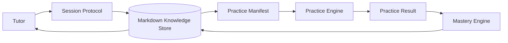

# Architecture

Gallop separates responsibility into five deliberately small layers.

1. **Teacher Layer** — explanation, Socratic questioning, oral examination,
   research supervision, and truthful structured session output.
2. **Knowledge Layer** — canonical sessions, concepts, mistakes, research notes,
   practice history, review state, and learning state. The default is Markdown/
   Obsidian and it remains the source of truth.
3. **Practice Layer** — question generation, quizzes, reinforcement, and
   material-based tutoring. DeepTutor is the default external implementation.
4. **Mastery Layer** — conservative state transitions based on correctness,
   independence, hints, repeated performance, recall, transfer, and explanation.
5. **Integration Layer** — schemas and adapters connecting the other layers.

## Adapter boundaries

- `TutorAdapter` is represented in v0.1 by the session protocol.
- `KnowledgeStoreAdapter` is implemented by `ObsidianAdapter`.
- `PracticeEngineAdapter` is implemented by `DeepTutorAdapter`.
- `MasteryEngine` is native Gallop code.
- `ReviewScheduler` preserves T+1/T+7/T+30 dates, while the knowledge store owns state.

Gallop v0.1 uses Python protocols only where orchestration needs a boundary. It
does not implement dynamic discovery, dependency injection, or a plugin runtime.

## Trust and failure boundaries

- A malformed manifest or result is rejected before state mutation.
- A missing or failed practice engine raises an explicit error.
- Integration tests write only to `integration_tests`.
- Mastery state is written atomically through a temporary file.
- The practice engine never becomes the canonical knowledge store.
- Logs and state must contain identifiers and outcomes, not credentials or note bodies.

## External dependency boundary

DeepTutor is installed separately. Gallop owns only its adapter, schemas,
configuration, documentation, and tests. This keeps upgrades and licenses clear.

